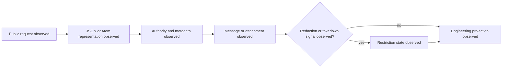

# Alaveteli Deployment and Source Audit

Status: platform/source audit complete; individual deployment validation is
still required. Alaveteli is an open-source FOI platform, not a jurisdictional
legal regime. A deployment may customise authorities, themes, translations,
email handling, redaction, retention, and workflow configuration.

## Authoritative Platform Sources

- [Alaveteli documentation](https://alaveteli.org/docs/)
- [API documentation](https://alaveteli.org/docs/developers/api/)
- [Deployment guidance](https://alaveteli.org/docs/installing/deploy/)
- [Production server guidance](https://alaveteli.org/docs/running/server/)
- [Upstream source repository](https://github.com/mysociety/alaveteli)

The read API exposes JSON and Atom representations, but availability and
meaning must be verified per deployment. Public URLs are not evidence that a
deployment's configuration, history, or retention policy matches another
instance.

## Required Deployment Evidence

Each instance must provide a capture record containing:

| Field | Requirement |
| --- | --- |
| `deployment_url` | canonical public URL |
| `deployment_revision` | visible release/commit or capture digest |
| `jurisdiction` | explicit jurisdiction profile, never inferred from host name |
| `api_surface` | JSON/Atom endpoints tested and captured |
| `authority_snapshot_sha256` | digest of authority/source snapshot |
| `capture_window` | bounded observation interval |
| `redaction_and_retention` | documented or `unknown` |
| `promotion_boundary` | `engineering_only` until independently reviewed |

No deployment is promoted from this audit alone. Requests, messages, and
attachments need the same privacy, rights, provenance, and removal checks as
other archive inputs.

## Observed Platform Flow



```xml
<definitions xmlns="http://www.omg.org/spec/BPMN/20100524/MODEL" id="alaveteli-observed-platform-flow"><process id="alaveteli-observed-platform-flow" isExecutable="false"><startEvent id="request" name="Public request observed"/><task id="feed" name="JSON or Atom representation observed"/><task id="authority" name="Authority and metadata observed"/><task id="message" name="Message or attachment observed"/><task id="restriction" name="Restriction state observed"/><task id="projection" name="Engineering projection observed"/></process></definitions>
```
