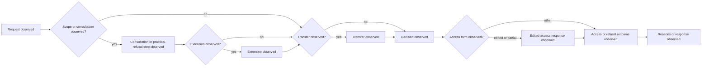

# Australia Commonwealth Foundation Profile

Status: engineering foundation only. This profile describes observable case
and process stages from a pinned source boundary; it does not decide whether
an agency complied with the Freedom of Information Act 1982.

## Source Boundary

- Act: [Freedom of Information Act 1982, Compilation No. 117, 1 January 2025](https://www.legislation.gov.au/C2004A02562/2025-01-01/2025-01-01/text/original/epub/OEBPS/document_1/document_1.html)
- Workflow vocabulary: sections 15 (requests), 15AA and 15AB (extensions),
  15AC (decision not made in time), 16 (transfers), 20 (forms of access),
  22 (edited copies), 24/24AA/24AB (practical refusal process), 26 (reasons),
  and 27/27A (consultation).
- `source_version`: `au-commonwealth-legislation:foi-1982:compilation-117-2025-01-01`
- `temporal_scope`: `in-force-at-compilation-date; amendments after capture excluded`
- `legal_assertion`: `none`

The source URL and compilation identifier are provenance fields, not a legal
interpretation. Any deadline, exemption, or jurisdictional conclusion needs a
separately reviewed rule profile and human review record.

## Case Evidence Contract

Each sample must carry the common profile fields:

| Field | Requirement |
| --- | --- |
| `jurisdiction` | `jurisdiction:AU-COMMONWEALTH` |
| `source_manifest_sha256` | immutable archive manifest digest |
| `source_locator` | archive, agency, or legislation locator |
| `observed_at` | capture timestamp |
| `temporal_scope` | source applicability interval or `unknown` |
| `annotation_status` | `unreviewed`, `independently_reviewed`, or `human_certified` |
| `uncertainty` | explicit uncertainty object |
| `promotion_boundary` | `engineering_only` until independent review exists |

Positive and negative labels describe sampling strata only. They are not legal
outcomes, compliance findings, or performance claims.

## Observed Process Model



These labels record observed events. They do not assert that a consultation,
extension, transfer, decision, or refusal was legally available or valid.

## Paired BPMN Contract

The activity labels correspond to the Mermaid model and are intentionally
non-executable. Gate and sequence semantics require event evidence.

```xml
<?xml version="1.0" encoding="UTF-8"?>
<definitions xmlns="http://www.omg.org/spec/BPMN/20100524/MODEL" id="au-commonwealth-observed-foi-process">
  <process id="au-commonwealth-observed-foi-process" isExecutable="false">
    <startEvent id="request-observed" name="Request observed"/>
    <task id="consultation-observed" name="Consultation or practical-refusal step observed"/>
    <task id="extension-observed" name="Extension observed"/>
    <task id="transfer-observed" name="Transfer observed"/>
    <task id="decision-observed" name="Decision observed"/>
    <task id="edited-access-observed" name="Edited-access response observed"/>
    <task id="outcome-observed" name="Access or refusal outcome observed"/>
    <task id="reason-observed" name="Reasons or response observed"/>
  </process>
</definitions>
```

The profile is not complete empirical validation until representative cases,
independent annotation/adjudication, replay/isolation checks, and source
coverage evidence are attached.
