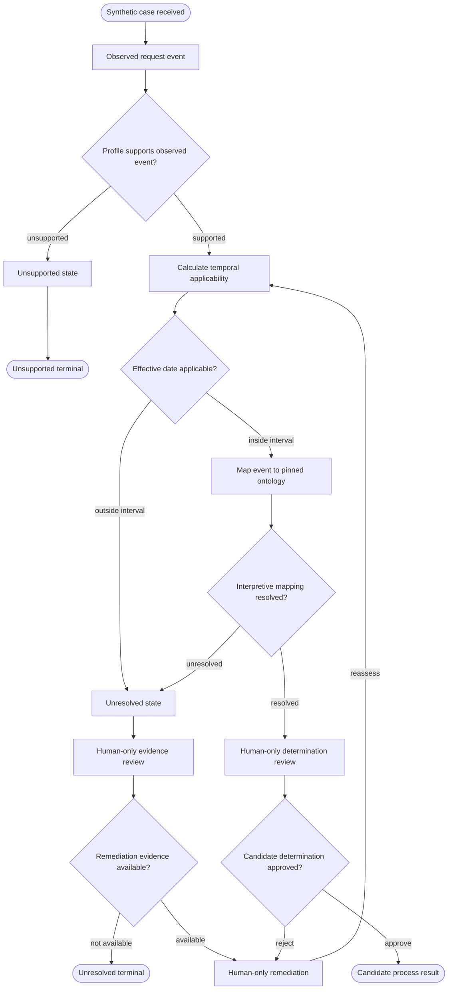

# Synthetic Australian State Process-Profile Template

Status: jurisdiction-neutral engineering contract only. This template does not
contain authentic source material, copy Commonwealth or New South Wales rules,
or make legal, compliance, timeliness, entitlement, exemption, or outcome
findings.

It separates four evidence and decision classes:

1. **Observed events** record only what a pinned source artifact exposes.
2. **Deterministic calculations** apply a pinned transformation to pinned
   values without interpreting law.
3. **Interpretive mappings** remain candidates until independently reviewed
   against a jurisdiction-specific ontology and source pack.
4. **Human-only decisions** include approval, legal interpretation, and
   remediation choices. Automation may prepare a packet but cannot approve it.

`unresolved` and `unsupported` are valid fail-closed states. Neither may be
silently converted to a negative observation or inferred legal outcome.

## Machine Contract

The five pins are deliberately synthetic. A jurisdiction-specific successor
must replace every pin with an exact approved artifact and retain the same
fail-closed semantics.

```foi-process-profile-v2
{
  "schema_version": "2.0.0",
  "template_id": "foi-process:template:au-state-synthetic:v1",
  "evidence_class": "synthetic_engineering_only",
  "legal_conclusions_allowed": false,
  "pins": {
    "profile": {
      "id": "synthetic-profile:au-state-template:0.1.0",
      "sha256": "b81ad3c99fe0682227cb71be48e0d0da9fbfb7843b34674895277089271a86e0"
    },
    "source": {
      "id": "synthetic-source:au-state-engineering-fixture:1",
      "sha256": "8310f1934339dc2538f50d2f128356c19f82f0f14a2a8b8551ff1cd22747ea1d"
    },
    "effective_date": {
      "id": "synthetic-effective-interval:2026-01-01/2026-12-31",
      "from": "2026-01-01",
      "to": "2026-12-31",
      "sha256": "9b8802a1c97dde770b1701628b4a5a54c727e09747b7581f6f051650c0e16622"
    },
    "transformation": {
      "id": "foi-process:state-template-transform:0.1.0",
      "sha256": "6d0ba4438e0ce8561b20ff8d57cb0c452c5f4d0b9c816a8bfc0fb415bc8c2853"
    },
    "ontology": {
      "id": "foi-o:synthetic-australian-process-ontology:0.1.0",
      "sha256": "b7723127db5f3e7fbfc78511baa7282f590ea16a7594659a37b556280eb3f2b1"
    }
  },
  "required_semantic_kinds": [
    "observed",
    "deterministic",
    "interpretive",
    "human_only",
    "state",
    "gateway",
    "event"
  ],
  "required_states": {
    "unresolved": "state_unresolved",
    "unsupported": "state_unsupported"
  },
  "required_rejection_edges": [
    {
      "source": "gw_supported",
      "target": "state_unsupported",
      "label": "unsupported"
    },
    {
      "source": "gw_human",
      "target": "human_remediate",
      "label": "reject"
    }
  ],
  "required_remediation_edge": {
    "source": "human_remediate",
    "target": "calc_temporal",
    "label": "reassess"
  }
}
```

## Paired Mermaid Contract

Node IDs, labels, semantic classes, sequence flows, and branch labels are part
of the contract. The rejection and remediation paths are explicit.



## Paired BPMN 2.0 Contract

This is a genuine, non-executable BPMN 2.0 process graph. Every Mermaid node
and branch has an equal BPMN node or sequence flow. `foip:kind` preserves the
evidence/decision boundary mechanically.

```xml
<?xml version="1.0" encoding="UTF-8"?>
<definitions xmlns="http://www.omg.org/spec/BPMN/20100524/MODEL"
             xmlns:foip="https://foi-process.dev/ns/profile"
             id="au-state-synthetic-template"
             targetNamespace="https://foi-process.dev/bpmn/australian-state-template">
  <process id="au-state-synthetic-template" isExecutable="false">
    <startEvent id="start" name="Synthetic case received" foip:kind="event"/>
    <task id="obs_request" name="Observed request event" foip:kind="observed"/>
    <exclusiveGateway id="gw_supported" name="Profile supports observed event?" foip:kind="gateway"/>
    <task id="state_unsupported" name="Unsupported state" foip:kind="state"/>
    <endEvent id="end_unsupported" name="Unsupported terminal" foip:kind="event"/>
    <task id="calc_temporal" name="Calculate temporal applicability" foip:kind="deterministic"/>
    <exclusiveGateway id="gw_temporal" name="Effective date applicable?" foip:kind="gateway"/>
    <task id="state_unresolved" name="Unresolved state" foip:kind="state"/>
    <task id="human_review" name="Human-only evidence review" foip:kind="human_only"/>
    <exclusiveGateway id="gw_remediation" name="Remediation evidence available?" foip:kind="gateway"/>
    <endEvent id="end_unresolved" name="Unresolved terminal" foip:kind="event"/>
    <task id="map_event" name="Map event to pinned ontology" foip:kind="interpretive"/>
    <exclusiveGateway id="gw_mapping" name="Interpretive mapping resolved?" foip:kind="gateway"/>
    <task id="human_decision" name="Human-only determination review" foip:kind="human_only"/>
    <exclusiveGateway id="gw_human" name="Candidate determination approved?" foip:kind="gateway"/>
    <task id="human_remediate" name="Human-only remediation" foip:kind="human_only"/>
    <endEvent id="end_ready" name="Candidate process result" foip:kind="event"/>

    <sequenceFlow id="flow-01" sourceRef="start" targetRef="obs_request"/>
    <sequenceFlow id="flow-02" sourceRef="obs_request" targetRef="gw_supported"/>
    <sequenceFlow id="flow-03" name="unsupported" sourceRef="gw_supported" targetRef="state_unsupported"/>
    <sequenceFlow id="flow-04" sourceRef="state_unsupported" targetRef="end_unsupported"/>
    <sequenceFlow id="flow-05" name="supported" sourceRef="gw_supported" targetRef="calc_temporal"/>
    <sequenceFlow id="flow-06" sourceRef="calc_temporal" targetRef="gw_temporal"/>
    <sequenceFlow id="flow-07" name="outside interval" sourceRef="gw_temporal" targetRef="state_unresolved"/>
    <sequenceFlow id="flow-08" name="inside interval" sourceRef="gw_temporal" targetRef="map_event"/>
    <sequenceFlow id="flow-09" sourceRef="map_event" targetRef="gw_mapping"/>
    <sequenceFlow id="flow-10" name="unresolved" sourceRef="gw_mapping" targetRef="state_unresolved"/>
    <sequenceFlow id="flow-11" name="resolved" sourceRef="gw_mapping" targetRef="human_decision"/>
    <sequenceFlow id="flow-12" sourceRef="state_unresolved" targetRef="human_review"/>
    <sequenceFlow id="flow-13" sourceRef="human_review" targetRef="gw_remediation"/>
    <sequenceFlow id="flow-14" name="not available" sourceRef="gw_remediation" targetRef="end_unresolved"/>
    <sequenceFlow id="flow-15" name="available" sourceRef="gw_remediation" targetRef="human_remediate"/>
    <sequenceFlow id="flow-16" sourceRef="human_decision" targetRef="gw_human"/>
    <sequenceFlow id="flow-17" name="reject" sourceRef="gw_human" targetRef="human_remediate"/>
    <sequenceFlow id="flow-18" name="approve" sourceRef="gw_human" targetRef="end_ready"/>
    <sequenceFlow id="flow-19" name="reassess" sourceRef="human_remediate" targetRef="calc_temporal"/>
  </process>
</definitions>
```

## Fixture Boundary

The paired fixture bundle contains exactly four synthetic scenarios: positive,
negative, temporal, and non-equivalence. Its labels are engineering
expectations, not legal findings. A future jurisdiction instance must replace
these fixtures with separately authorized evidence and cannot claim
cross-profile equivalence without an explicit, pinned crosswalk.
