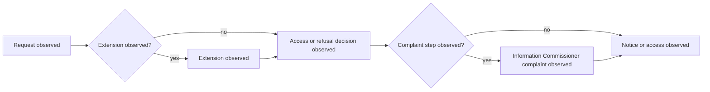

# Canada Federal Foundation Profile

Status: engineering foundation only. This profile records observed stages and
does not determine whether an institution complied with Canadian law.

## Source Boundary

- Act: [Access to Information Act, R.S.C. 1985, c. A-1](https://laws-lois.justice.gc.ca/eng/acts/A-1/FullText.html/)
- Vocabulary: sections 4 (right of access), 6.1 (declining to act), 7 (notice),
  9 (extensions), 10 (refusal notices), 12 (access), 30 (complaints), and 31
  (complaint time limit).
- `source_version`: `ca-federal-statute:access-to-information:a-1-capture-2026-07-21`
- `temporal_scope`: `current-source-at-capture; amendments require recapture`
- `legal_assertion`: `none`

Every case must retain immutable source provenance, temporal scope, uncertainty,
annotation status, and `promotion_boundary: engineering_only`.

## Observed Process Model



```xml
<?xml version="1.0" encoding="UTF-8"?>
<definitions xmlns="http://www.omg.org/spec/BPMN/20100524/MODEL" id="ca-federal-observed-foi-process">
  <process id="ca-federal-observed-foi-process" isExecutable="false">
    <startEvent id="request-observed" name="Request observed"/>
    <task id="extension-observed" name="Extension observed"/>
    <task id="decision-observed" name="Access or refusal decision observed"/>
    <task id="review-observed" name="Information Commissioner complaint observed"/>
    <task id="notice-observed" name="Notice or access observed"/>
  </process>
</definitions>
```

The model is observational, not a legal rule engine; empirical validation and
independent adjudication remain required.
