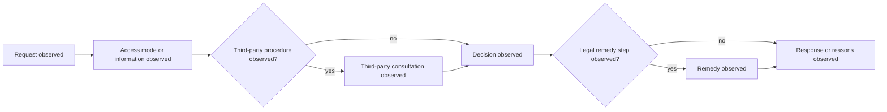

# Germany Federal Foundation Profile

Status: engineering foundation only. Source: [Federal Freedom of Information Act (IFG)](https://www.gesetze-im-internet.de/englisch_ifg/englisch_ifg.html), whose English translation may lag the German text. `source_version`: `de-federal-ifg:english-capture-2026-07-21`; `temporal_scope`: `translation-at-capture`; `legal_assertion`: `none`.

Cases require immutable provenance, temporal scope, uncertainty, annotation status, and `promotion_boundary: engineering_only`.



```xml
<definitions xmlns="http://www.omg.org/spec/BPMN/20100524/MODEL" id="de-observed-foi-process"><process id="de-observed-foi-process" isExecutable="false"><startEvent id="request" name="Request observed"/><task id="access" name="Access mode or information observed"/><task id="consultation" name="Third-party consultation observed"/><task id="decision" name="Decision observed"/><task id="remedy" name="Remedy observed"/><task id="response" name="Response or reasons observed"/></process></definitions>
```
