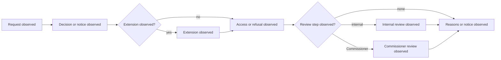

# Ireland Foundation Profile

Status: engineering foundation only. This profile records observable stages
against the enacted source and does not determine whether an Irish FOI body
made a lawful decision or applied an exemption correctly.

## Source Boundary

- Act: [Freedom of Information Act 2014](https://www.irishstatutebook.ie/eli/2014/act/30/enacted/en/html)
- Workflow vocabulary: sections 12 (requests), 13 (decisions and notices),
  14 (extensions), 15 (administrative refusal), 19 (deemed decisions), 21
  (internal review), and 22 (Information Commissioner review).
- `source_version`: `ie-statute:foi-2014:enacted-capture-2026-07-21`
- `temporal_scope`: `enacted-text-at-capture; revised text requires recapture`
- `legal_assertion`: `none`

Source identity is provenance, not legal advice. Deadline, exemption, review,
and public-interest conclusions require a versioned rule profile and human
certification.

## Case Evidence Contract

Each case uses `jurisdiction:IE`, an immutable manifest digest and source
locator, observation timestamp, temporal scope, annotation status, explicit
uncertainty, and `promotion_boundary: engineering_only`. Positive and negative
labels are sampling strata only.

## Observed Process Model



The labels describe observed events and do not assert that a decision,
extension, refusal, or review was legally available or valid.

## Paired BPMN Contract

```xml
<?xml version="1.0" encoding="UTF-8"?>
<definitions xmlns="http://www.omg.org/spec/BPMN/20100524/MODEL" id="ie-observed-foi-process">
  <process id="ie-observed-foi-process" isExecutable="false">
    <startEvent id="request-observed" name="Request observed"/>
    <task id="decision-observed" name="Decision or notice observed"/>
    <task id="extension-observed" name="Extension observed"/>
    <task id="response-observed" name="Access or refusal observed"/>
    <task id="internal-review-observed" name="Internal review observed"/>
    <task id="commissioner-review-observed" name="Commissioner review observed"/>
    <task id="reason-observed" name="Reasons or notice observed"/>
  </process>
</definitions>
```

Empirical validation remains gated on representative cases, independent
annotation/adjudication, replay/isolation checks, and coverage evidence.
