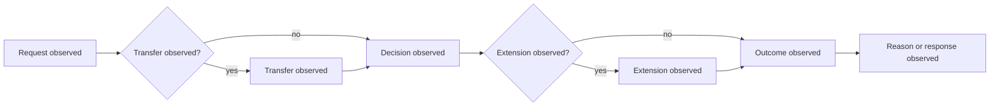

# New Zealand Foundation Profile

Status: engineering foundation only. This profile records observed workflow
stages and source provenance; it does not determine whether an authority acted
lawfully or whether a request is compliant with the Official Information Act.

## Source Boundary

- Act: [Official Information Act 1982, current reprint](https://www.legislation.govt.nz/act/public/1982/0156/latest/DLM64784.html)
- Relevant source sections for workflow vocabulary: 12 (requests), 14 (transfer),
  15 (decisions), 15A (extensions), 18 (refusal), and 19 (reasons).
- `source_version`: `nz-legislation:oia-1982:current-reprint`
- `temporal_scope`: `as-published-by-source-at-capture`
- `legal_assertion`: `none`

The source URL and version are provenance fields, not a legal interpretation.
Any statutory classification or deadline conclusion requires a separately
reviewed rule profile and a human review record.

## Case Evidence Contract

Every case sample must carry:

| Field | Requirement |
| --- | --- |
| `jurisdiction` | `jurisdiction:NZ` |
| `source_manifest_sha256` | immutable archive manifest digest |
| `source_locator` | public archive or legislation locator |
| `observed_at` | capture timestamp |
| `temporal_scope` | source applicability interval or `unknown` |
| `annotation_status` | `unreviewed`, `independently_reviewed`, or `human_certified` |
| `uncertainty` | explicit uncertainty object; never inferred as certainty |
| `promotion_boundary` | `engineering_only` until independent review exists |

Positive and negative examples are sampling labels only. They must never be
used as legal outcomes or performance claims without independent adjudication.

## Observed Process Model



This is an observation model. The `Transfer`, `Extension`, `Decision`, and
`Reason` nodes are event labels, not assertions that a statutory condition was
met.

## Paired BPMN Contract

The corresponding BPMN activity labels are intentionally the same as the
Mermaid model so that the two representations can be compared mechanically.

```xml
<?xml version="1.0" encoding="UTF-8"?>
<definitions xmlns="http://www.omg.org/spec/BPMN/20100524/MODEL" id="nz-observed-foi-process">
  <process id="nz-observed-foi-process" isExecutable="false">
    <startEvent id="request-observed" name="Request observed"/>
    <task id="transfer-observed" name="Transfer observed"/>
    <task id="decision-observed" name="Decision observed"/>
    <task id="extension-observed" name="Extension observed"/>
    <task id="outcome-observed" name="Outcome observed"/>
    <task id="reason-observed" name="Reason or response observed"/>
  </process>
</definitions>
```

The BPMN fragment is a non-executable representation. Sequence and gateway
semantics must be populated only from observed event evidence.
