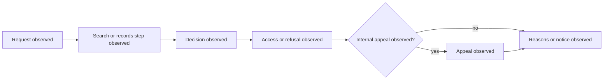

# South Africa Foundation Profile

Status: engineering foundation only. Source: [Promotion of Access to Information Act 2 of 2000](https://www.gov.za/documents/promotion-access-information-act). `source_version`: `za-paia-2-2000:official-capture-2026-07-21`; `temporal_scope`: `official source at capture`; `legal_assertion`: `none`.

Cases require immutable provenance, temporal scope, uncertainty, annotation status, and `promotion_boundary: engineering_only`.



```xml
<definitions xmlns="http://www.omg.org/spec/BPMN/20100524/MODEL" id="za-observed-foi-process"><process id="za-observed-foi-process" isExecutable="false"><startEvent id="request" name="Request observed"/><task id="search" name="Search or records step observed"/><task id="decision" name="Decision observed"/><task id="response" name="Access or refusal observed"/><task id="appeal" name="Appeal observed"/><task id="reasons" name="Reasons or notice observed"/></process></definitions>
```
