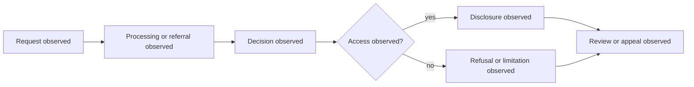

# Spain Foundation Profile

Status: engineering foundation only. Source: [Law 19/2013 on transparency and access to public information](https://www.boe.es/buscar/pdf/2013/BOE-A-2013-12887-consolidado.pdf). `source_version`: `es-law-19-2013:consolidated-capture-2026-07-21`; `temporal_scope`: `consolidated-text-at-capture`; `legal_assertion`: `none`.

Cases require immutable provenance, temporal scope, uncertainty, annotation status, and `promotion_boundary: engineering_only`.



```xml
<definitions xmlns="http://www.omg.org/spec/BPMN/20100524/MODEL" id="es-observed-foi-process"><process id="es-observed-foi-process" isExecutable="false"><startEvent id="request" name="Request observed"/><task id="processing" name="Processing or referral observed"/><task id="decision" name="Decision observed"/><task id="disclosure" name="Disclosure observed"/><task id="refusal" name="Refusal or limitation observed"/><task id="appeal" name="Review or appeal observed"/></process></definitions>
```
