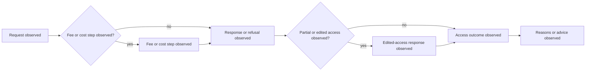

# United Kingdom Foundation Profile

Status: engineering foundation only. The profile records observable workflow
stages against a pinned Act text and makes no finding about compliance,
exemption, public-interest balancing, or appeal rights in an individual case.

## Source Boundary

- Act: [Freedom of Information Act 2000](https://www.legislation.gov.uk/ukpga/2000/36/pdfs/ukpga_20000036_en.pdf)
- Workflow vocabulary: sections 1 (right of access), 8 (requests), 9 (fees),
  10 (time for compliance), 11 (means of communication), 12 (cost limit),
  14 (vexatious or repeated requests), 16 (advice and assistance), 17
  (refusal), and 19 (publication schemes).
- `source_version`: `uk-legislation:foia-2000:ukpga-2000-36-captured-2026-07-21`
- `temporal_scope`: `source-text-at-capture; later amendments require recapture`
- `legal_assertion`: `none`

The source and capture identifier establish provenance only. Any legal rule
evaluation requires a versioned profile, authoritative amendment review, and
human certification.

## Case Evidence Contract

Use the common jurisdiction fields: `jurisdiction:UK`, immutable manifest
digest, source locator, observation time, temporal scope, annotation status,
explicit uncertainty, and `promotion_boundary: engineering_only`. Positive and
negative labels are sampling strata, not legal outcomes.

## Observed Process Model



The labels describe captured events and do not assert that a fee, refusal,
partial disclosure, or advice duty applied.

## Paired BPMN Contract

```xml
<?xml version="1.0" encoding="UTF-8"?>
<definitions xmlns="http://www.omg.org/spec/BPMN/20100524/MODEL" id="uk-observed-foi-process">
  <process id="uk-observed-foi-process" isExecutable="false">
    <startEvent id="request-observed" name="Request observed"/>
    <task id="fee-observed" name="Fee or cost step observed"/>
    <task id="response-observed" name="Response or refusal observed"/>
    <task id="edited-access-observed" name="Edited-access response observed"/>
    <task id="outcome-observed" name="Access outcome observed"/>
    <task id="reason-observed" name="Reasons or advice observed"/>
  </process>
</definitions>
```

This foundation is not empirical validation until representative cases,
independent annotation/adjudication, replay/isolation checks, and coverage
evidence are attached.
