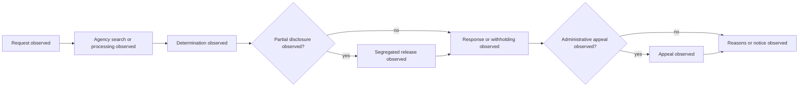

# United States Federal Foundation Profile

Status: engineering foundation only. This profile describes observed FOIA
workflow stages and makes no finding about exemption applicability or agency
compliance.

## Source Boundary

- Act: [5 U.S.C. § 552](https://uscode.house.gov/view.xhtml?edition=prelim&num=0&req=granuleid%3AUSC-prelim-title5-section552)
- Vocabulary: agency request procedures, determination, partial disclosure and
  segregation, exemptions, written reasons, and administrative appeal.
- `source_version`: `us-federal-code:title-5-section-552:prelim-capture-2026-07-21`
- `temporal_scope`: `preliminary Code text at capture; later changes require recapture`
- `legal_assertion`: `none`

Cases require immutable provenance, temporal scope, uncertainty, annotation
status, and `promotion_boundary: engineering_only`.

## Observed Process Model



```xml
<?xml version="1.0" encoding="UTF-8"?>
<definitions xmlns="http://www.omg.org/spec/BPMN/20100524/MODEL" id="us-federal-observed-foi-process">
  <process id="us-federal-observed-foi-process" isExecutable="false">
    <startEvent id="request-observed" name="Request observed"/>
    <task id="search-observed" name="Agency search or processing observed"/>
    <task id="determination-observed" name="Determination observed"/>
    <task id="segregated-release-observed" name="Segregated release observed"/>
    <task id="response-observed" name="Response or withholding observed"/>
    <task id="appeal-observed" name="Appeal observed"/>
    <task id="reasons-observed" name="Reasons or notice observed"/>
  </process>
</definitions>
```

Empirical and legal promotion remain gated on representative cases and
independent review.
