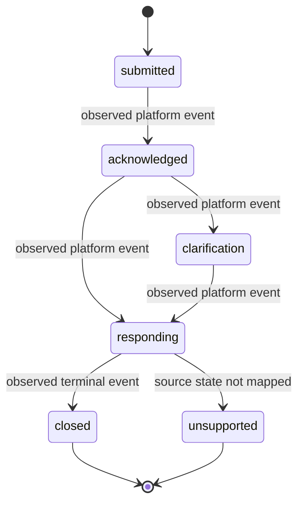

# Jurisdiction Process-Model Profile

Use this template when onboarding a jurisdiction or FOI platform. It describes
observable platform behaviour and deterministic calculations only. It does not
certify legal meaning, deadlines, exemptions, or compliance.

## Profile identity

| Field | Value |
|---|---|
| `profile_id` | `urn:foi-process:jurisdiction:<jurisdiction>:<profile>` |
| `jurisdiction` | `<jurisdiction>` |
| `platform` | `<platform>` |
| `source_uri` | `<authoritative source>` |
| `effective_from` | `<ISO-8601 date>` |
| `effective_to` | `<ISO-8601 date or null>` |
| `maturity` | `synthetic_only \| observed \| reviewed \| promoted` |

## Evidence layers

1. **Observed events**: captured platform facts, timestamps, source digests,
   and unsupported states.
2. **Deterministic calculations**: reproducible intervals, ordering, and
   process transitions derived from observed events.
3. **Interpretive mappings**: explicitly labelled candidate mappings to a
   jurisdiction vocabulary, with source and effective-date pins.
4. **Human legal determinations**: separate review records; never inferred from
   the process model.

## State profile

## Acceptance gates

- [ ] Source and effective-date pins recorded.
- [ ] Positive, negative, temporal, and non-equivalence synthetic fixtures pass.
- [ ] Unsupported and unresolved states remain visible.
- [ ] Deterministic calculations reproduce byte-identical outputs.
- [ ] Interpretive mappings have independent source review.
- [ ] Human-only legal determinations have named review evidence.
- [ ] No empirical or legal validation is claimed before promotion.
